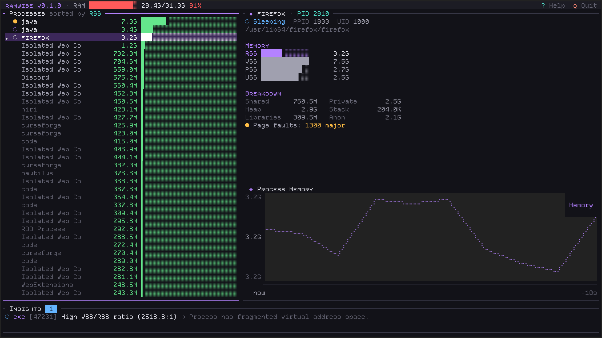

# ramwise

> Your memory's wise advisor - Intelligent RAM usage visualizer for Arch Linux


**ramwise** is a terminal-based RAM usage visualizer that goes beyond basic memory monitoring. It provides deep memory introspection, intelligent leak detection, and beautiful visualization all in a lightweight TUI application.

## Features

- **Deep Memory Introspection** - See RSS, PSS, USS, shared/private breakdown per process
- **Intelligent Insights** - Rule-based analysis detects memory leaks, hogs, and anomalies
- **Beautiful TUI** - Modern interface with graphs, colors, and intuitive navigation
- **Minimal Footprint** - Written in Rust for maximum efficiency
- **Real-time Updates** - Live monitoring with configurable refresh rate
- **Process Control** - Stop (`SIGTERM`) or kill (`SIGKILL`) selected processes directly from the TUI

### Snapshot exports

The collector exposes a versioned `ExportSnapshot` contract for integrations and
future export formats. It uses wall-clock Unix milliseconds, explicit byte/count
units, collector metadata, and capability markers. Runtime-only monotonic
`Instant` values are intentionally not serialized; unavailable features remain
explicit in the exported capability map.

## Screenshots



## Installation

### From Source

```bash
# Clone the repository
git clone https://github.com/Duckaet/ramwise
cd ramwise

# Build release binary
cargo build --release

# Install (optional)
sudo cp target/release/ramwise /usr/local/bin/
```

## Usage

```bash
# Run with default settings (1s refresh, 1MB minimum RSS)
ramwise

# Custom refresh interval (500ms)
ramwise --interval 500

# Show all processes (including small ones)
ramwise --min-rss 0

# Disable smaps collection (faster but less detailed)
ramwise --no-smaps

# Enable debug logging
ramwise --debug

# Use light mode
ramwise -t light
```

## Keyboard Shortcuts

| Key | Action |
|-----|--------|
| `j/k` or `↑/↓` | Navigate process list |
| `Tab` | Cycle focus between panels |
| `Shift+Tab` | Reverse cycle focus |
| `s` | Cycle sort mode (RSS/PSS/Private/Name/PID) |
| `g` | Go to top of list |
| `G` | Go to bottom of list |
| `x` | Send `SIGTERM` to selected process |
| `X` | Confirm and send `SIGKILL` to selected process |
| `?` | Toggle help overlay |
| `q` | Quit |

Notes:
- `SIGKILL` requires confirmation in-app (`Enter` confirm, `Esc` cancel).
- Process control follows OS permissions; root-owned processes may return permission errors.

## Process Control

ramwise now supports direct process signaling from the process list:

1. Select a process with `j/k` or `↑/↓`.
2. Press `x` to send `SIGTERM` (graceful stop).
3. Press `X` to open kill confirmation, then:
   - `Enter` to send `SIGKILL`
   - `Esc` to cancel

Action results are shown as in-app status messages (success, warning, or error).

## Configuration

### Themes
ramwise includes built-in themes selectable via `--theme` or `-t`:
```bash
# Launch with dark theme (default)
ramwise -t dark

# Launch with light theme (Gruvbox Light)
ramwise -t light
```

Custom themes can be added to `src/ui/theme.rs` and registered in `App::new` (`src/app.rs`).

### Layout Customization
Layout dimensions and panel splits can be customized in `src/ui/layout.rs` (`Layout::new`):
- `header_height`: Height of the top status bar.
- `center_height`: Minimum height of the main process/detail panels.
- `bottom_height`: Height of the insights panel.
- `left_width_percent`: Width percentage allocated to the process list.
- `side_vertical_split_percent`: Height percentage allocated to process details vs memory graph.
- `invert_horizontal_split`: Swap process list and side panels.
- `invert_side_vertical_split`: Swap detail view and trend graph.
- `put_insights_on_top`: Place the insights panel below the header instead of at the bottom.


## Insight Rules

ramwise includes intelligent analysis rules:

| Rule | Severity | Description |
|------|----------|-------------|
| Memory Leak Detector | Warning/Critical | Detects consistent RSS growth patterns |
| Memory Hog | Warning | Flags processes using >30% of total RAM |
| Sudden Spike | Warning | Alerts on rapid memory increases (>100MB in 10s) |
| OOM Risk | Critical | Warns when system is at risk of OOM |
| Swap Pressure | Warning | Detects excessive swap usage |
| Fragmentation | Info | Identifies high VSS/RSS ratios |
| Cache Info | Info | Explains high page cache usage |

## Architecture

```
ramwise/
├── src/
│   ├── main.rs              # Entry point, async event loop
│   ├── app.rs               # Application state
│   ├── collector/           # Memory data collection from /proc
│   ├── analyzer/            # Rule engine and insights
│   ├── history/             # Time-series data buffer
│   ├── ui/                  # Ratatui TUI components
│   └── utils/               # Formatting utilities
```

## Requirements

- Linux kernel 2.6.28+ (for `/proc/[pid]/smaps_rollup`)
- Terminal with color support

## Contributing

Contributions are welcome! Please feel free to submit a Pull Request.

## License

MIT License - see [LICENSE](LICENSE) for details.

## Credits

Built with:
- [Ratatui](https://github.com/ratatui/ratatui) - TUI framework
- [procfs](https://github.com/eminence/procfs) - /proc filesystem parser
- [Tokio](https://tokio.rs/) - Async runtime
